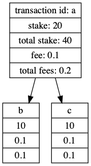

# Timelock: Fault-Tolerant Trustless Consensus through Time-locked Progressive Staking

## Stake Locking

Existing proof-of-stake cryptocurrency protocols involve participants staking currency for a chance to be the creator of the next block. The blockmaker is selected based on their stake and/or the time their stake has been locked away for. The primary problem with this style of proof-of-stake is that there is nothing at stake as particpants can stake currency on multiple forks of the blockchain. 

In the Timelock protocol, staked currency is locked away when a new block is created rather than before the blocks creations. The locked currency is freed after a certain amount of time has elapsed. The locking of the currency Participants can stake currency on multiple chain forks but their stake is only locked when a block is created. This makes it progressively more difficult for a malicious participant to build further blocks on any of the chain forks they have previously created a block on. 

In order to for a block to be created in the Timelock protocol, 1/3 of the total currency in circulation must be staked and the staked currency is locked away from 10 blocks. Suppose a malicious participant stakes controls 1/3 of the total free currency and creates a block. The malicious participant will be able to forge one fraudlent block but will be unable to continue keep forging as the particpants currency has been locked away. The network protect against such an attack buy waiting for 2 block confirmation to occur. 

## Progressive Staking

Each submitted transaction has a reward fee and stake requirement. In order for a transaction to be accepted by the network, another participant must stake Fantom equal to the stake requirement. The reward fee is 
a small amount Fantom allocated by the sender to pool used to pay rewards to the stakers. The total amount of Fantom in the reward pool is split amongst
the stakers proportional to the amount they staked.

The reward fee allows users to incentivise stakers to verify their transaction and increase the chance it will included in the next block.

A new block is created when the total amount staked in any subgraph since the 
last block has reached a certain fraction of the total Fantom in circulation.

## Block Finalisation
