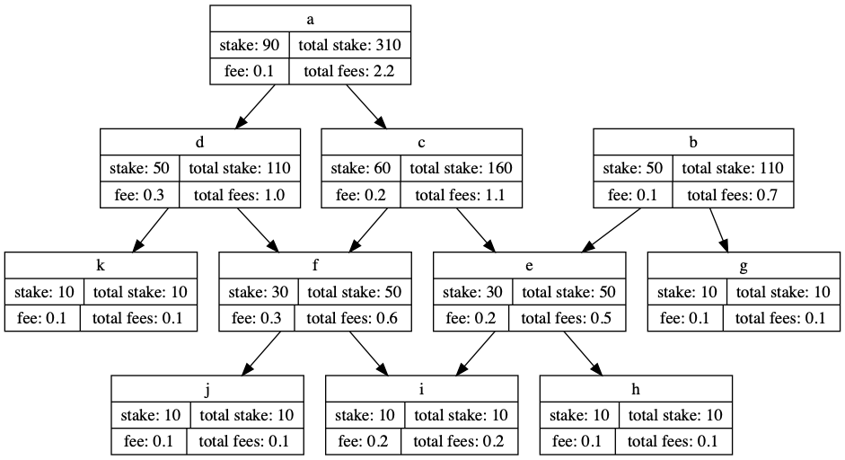

# Timelock: Fault-Tolerant Trustless Consensus through Time-locked Progressive Staking 

NOTE: This repository is currently a work-in-progress. The ideas are unproven and potentially have huge flaws. The repository has been published to encourage discussion and brainstorming.

This document contains two proposal for improvements to DAG based consensus algorithms.

1. [Progressive Staking](#Progressive-Staking) is a proposal to integrate proof-of-stake into DAG based blockchains.
2. [Stake Locking](#Stake-Locking) is a proposal to solve the nothing-at-stake problem.

## Progressive Staking: Proof-of-Stake for DAG based blockchains

Each submitted transaction has a reward fee and stake requirement. In order for a transaction to be accepted by the network, another participant must stake Fantom equal to the stake requirement. The stake requirement for transaction is proportional to the number of parent transactions since the last block. This is because to a staker needs to confirm all parent transactions since the last block to determine if a proposed transaction is valid.

The reward fee is a small amount Fantom allocated by the sender to pool used to pay rewards to the stakers. The reward fee allows transaction submitters to incentivise stakers to verify their transaction and increase the chance it will included in the next block. The total amount of Fantom in the reward pool is split amongst the stakers proportional to the amount they staked.

A new block is created when the total amount staked in any subgraph of the DAG is has reached a certain percentage of the total Fantom in circulation. A large fraction, for exampe 50%, will mean the the the network will be very secure as a malicious actor will need to own 50% of the total amount of coin in circulation. However it will take very long to confirm a new block with a 50% stake requirement. [Stake locking](#Stake-Locking) allows for a fast initial confirmation time with gradually increasing security as more blocks are confirmed. 

*DAG with stake requirements and reward fees* 

## Stake Locking

Existing proof-of-stake cryptocurrency protocols involve participants staking currency for a chance to be the creator of the next block. The blockmaker is selected based on their stake and/or the time their stake has been locked away for. The primary problem with this style of proof-of-stake is that there is nothing at stake as particpants can stake currency on multiple forks of the blockchain. 

In the Timelock protocol, staked currency is locked away when a new block is created rather than before the blocks creations. The locked currency is freed after a certain amount of time has elapsed. The locking of the currency Participants can stake currency on multiple chain forks but their stake is only locked when a block is created. This makes it progressively more difficult for a malicious participant to build further blocks on any of the chain forks they have previously created a block on. 

For example, In order to for a block to be created in the Timelock protocol, 1/3 of the total currency in circulation must be staked and the staked currency is locked away from 10 blocks. Suppose a malicious participant stakes controls 1/3 of the total free currency and creates a block. The malicious participant will be able to forge one fraudlent block but will be unable to continue keep forging as the particpants currency has been locked away. The network can protect against such an attack by waiting for 2 block confirmation to occur. 
